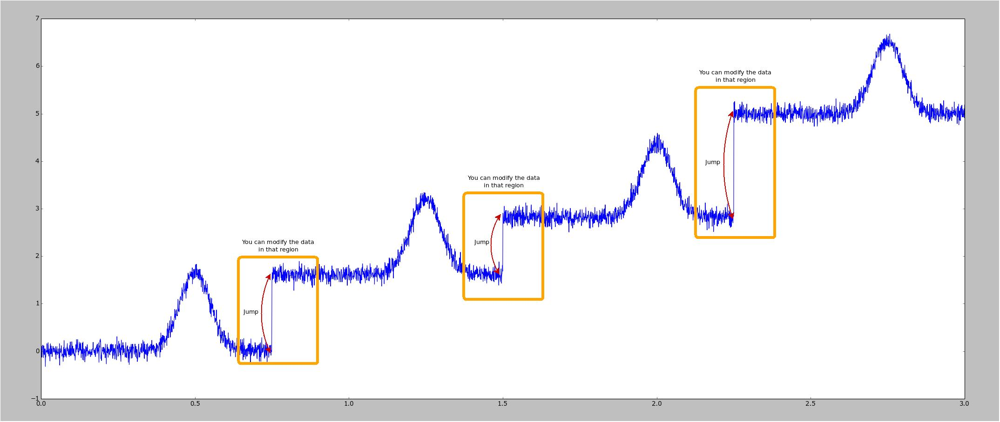

# hiring-test

## General idea
The goal is to solve the problem we're stating below in C++ (alternatively python could also be acceptable but not ideal).

Show us what you can do, and how you think. Our main focus will not be on how you master some voodoo trick of the language you chose, but rather on the way you managed to:
1) approach and solve the problem you were faced with
2) structure of your code (we will look for clean code with object oriented approach)
3) special bonus if you test a few functions of your code using unit test.

If you tried different solutions, then do say so (or even better send us several iterations of your work: from a quick hack to a more advanced solution!). Using libraries to do most of the work for you is perfectly OK.

Don't forget that we're always looking for ways to be more efficient, so some kind of visualization (no need for it to be made with C++) would really help us check your work, (and probably help you too in debugging). If you need inspiration, don't hesitate to check the `utils/generator.py`..

### In order for us to test your solution
1) Solutions should be designed to run on Linux.
2) Please provide instructions/scripts for installing and compiling with any libraries you have used.
4) **Provide a copy of your output data.**

## The Gaussian with Jumps test

### The idea behind the problem
The following problem is actually quite close to some of the work we've done at Shadow at some points. You can imagine the noisy data being the data acquired from a motion capture system and the jump a pause between two actions in this recording. We're then trying to replay that recorded data on a robot (hence the filtering, we want smooth movements), while avoiding jumping between the 2 different part of the action.

### The problem
We provide you with some data in the `data` folder (which has been generated using the `utils/generator.py` if you're interested). Each line of the file contains x and y, the y data is noisy. You have 3 main tasks:
 - Filter the data so that it is not as noisy
 - Detect when the jumps occur (some of the jumps are harder to detect than others, try to detect as many of them as you can). We suggest using the filtered data but it's up to you to decide.
 - Smoothly join the different parts in order to get rid of those discontinuities. You can drop or modify a reasonable part of the end of the trajectory N and the begining of trajectory N+1 to merge them as smoothly as possible. The idea is to bend the data around end of N and beginning of N+1 to have a smooth joining.
   
   - The time associated with each data is a very important part of the trajectory, so don't do a timeshift to make the bending easier.

You can find here a plot of the data highlighting what we mean by *jump in the data*, and where you can safely modify the data for a smooth joining.



## Running the generator again
If for some reason you'd like to regenerate some new data set, feel free to run the generator again. You can use `--plot` to plot the data if you want and `--path path/to/file` to save it in a given file.

```bash
python utils/generator.py --path data/sample.txt --plot
```
